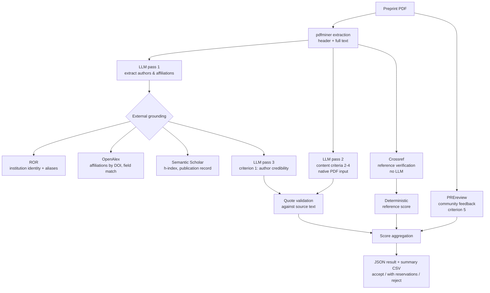

# Preprint Classification System

**LLM-based scoring of preprints that cite genomic data, to decide which ones are worth
linking to a genomic surveillance database.**

A preprint that reports or cites genomic sequence data is a candidate for being linked
into a genomic surveillance database. Whether it actually qualifies is a judgment about
the paper itself — who wrote it, how the study was designed, whether the results hold up,
what it cites — and it is made one preprint at a time.

This repository automates that judgment: it takes a preprint PDF, scores it against a
five-criterion rubric using an LLM **grounded in external scholarly APIs**, validates
the model's own evidence against the source text, and emits a structured recommendation
— `accept`, `accept_with_reservations` or `reject` — with a written justification for
every criterion.


---

## Why this is not just "ask an LLM to rate a paper"

A raw LLM judgment on a paper is confident, unverifiable, and wrong in ways you cannot
see. Four design choices address that directly:

| Problem | What the pipeline does |
|---|---|
| The model cannot know if an institution or an author is real | Author affiliations are resolved against **ROR** and **OpenAlex**, author track records against **Semantic Scholar** — by DOI first, name-matching only as a labelled fallback |
| The model invents supporting quotes | Every quote it cites as evidence is **matched back against the extracted PDF text** (`validate_quotes`); an unverifiable quote caps that criterion's score |
| The model bluffs about the bibliography | Reference entries are resolved against **Crossref**; the `references` score is computed **deterministically** from the verified count, not from the model's opinion |
| Silent data gaps become silent scoring errors | Enrichment failures are surfaced as explicit `data_quality_warnings` in the output, and the prompt tells the model which fields it may *not* trust |

Everything the model is asked to do that it can't be trusted to do alone is either
grounded in an API or checked after the fact.

---

## Architecture



The three LLM calls are deliberately separate: author credibility is scored from
structured, API-verified data only, so a persuasive paper cannot talk its way into a
better affiliation score.

---

## The rubric

Defined declaratively in [`criteria.yaml`](criteria.yaml) — scoring logic lives in data,
not in prompt strings. Each criterion is scored 1 (weak) / 2 (moderate) / 3 (strong).

| # | Criterion | Sub-criteria | Source of truth |
|---|---|---|---|
| 1 | **Author credibility** | institution reputability · author expertise · institutional collaboration | ROR + OpenAlex + Semantic Scholar |
| 2 | **Research question & methods** | objective & hypothesis · public-health relevance · study-design rigour | Paper text (quote-validated) |
| 3 | **Results & conclusion** | — | Paper text (quote-validated) |
| 4 | **References** | — | Crossref (deterministic count) |
| 5 | **Community feedback** | — | PREreview (scored only when reviews exist) |

Composite criteria average their sub-criteria rather than requiring every condition to
hold at once — an earlier AND-gate design made a score of 3 nearly unreachable and was
replaced after the first real runs.

---

## Quickstart

```bash
git clone https://github.com/JuanFinello/preprints-classification-system.git
cd preprints-classification-system
pip install -r requirements.txt
cp .env.example .env    # then add your API key
export OPENAI_API_KEY="sk-..."
```

Score a single preprint:

```bash
python evaluate_preprint.py \
    --pdf papers/10.1101_2025.06.14.659623.pdf \
    --criteria criteria.yaml \
    --out results_pipeline/10.1101_2025.06.14.659623.json
```

Score a directory of preprints and consolidate into one CSV:

```bash
python batch_evaluate.py \
    --papers-dir papers \
    --results-dir results_pipeline \
    --summary results_summary_pipeline.csv
```

Cross-model calibration (optional, needs `ANTHROPIC_API_KEY`):

```bash
python batch_evaluate_claude.py   # scores the same papers with Claude
python compare_scores.py          # agreement matrix between the two models
```

### Output shape

```json
{
  "source_pdf": "10.1101_2025.06.14.659623.pdf",
  "model": "gpt-5.6-terra",
  "n_pages": 60,
  "author_enrichment": { "...ROR / OpenAlex / Semantic Scholar evidence..." },
  "criteria": {
    "author_credibility": { "score": 3, "justification": "...", "sub_criteria": {} },
    "research_question_and_methods": { "score": 3, "quote_valid": true },
    "results_and_conclusion": { "score": 2, "justification": "..." },
    "references": { "score": 3, "citation_verification": {} },
    "feedback": { "score": null }
  },
  "scoring": {
    "average": 2.75, "total": 11, "max": 12,
    "recommendation": "accept", "quotes_invalid": []
  },
  "data_quality_warnings": []
}
```

Real examples live in [`results_pipeline/`](results_pipeline/); the flattened view of all
runs is in [`results_summary_pipeline.csv`](results_summary_pipeline.csv).

---

## What this project learned the hard way

These are the findings that shaped the design; they are documented because they are the
useful part.

1. **Content-policy refusals are an architectural constraint, not an edge case.**
   Molecular-virology preprints (viral receptors, host restriction factors,
   protein–host interactions) were refused outright by one provider's API — reproduced
   across four isolated diagnostics, including an 8 000-character abstract with a
   trivial instruction, which ruled out prompt length and rubric wording. Surveillance
   and diagnostics papers passed cleanly. For a genomic-surveillance use case that
   pattern hits exactly the papers that matter most, so the pipeline is built
   multi-backend (`evaluate_preprint.py`, `_claude.py`, `_deepseek.py` share one rubric
   and one scoring core) rather than betting on one vendor.

2. **Anchoring is real and criterion-specific.** In an early run, one model returned
   `results_and_conclusion = 1` for four papers out of four while the other model
   spread across 1–3. Verified in code that no deterministic function was forcing it —
   it was pure prompt bias, and it was fixed in the prompt, not in the aggregation.

3. **An agreement percentage can be meaningless.** The `references` criterion agreed
   ~65 % of the time between models, but one side computes it from a Crossref count and
   the other makes a qualitative judgment. Agreement there measures coincidence, not
   consensus — comparisons are only worth reporting when both sides answer the same
   question.

4. **A failed run must never look like a low score.** A parse failure was written to
   disk as `score: 1, justification: "Parse error"`, which aggregates to a perfectly
   plausible `reject`. Failures need to be structurally distinguishable from judgments.

---

## Repository layout

| Path | Role |
|---|---|
| `evaluate_preprint.py` | Core pipeline — extraction, API grounding, prompts, quote validation, scoring |
| `criteria.yaml` | The rubric: criteria, sub-criteria and score definitions |
| `batch_evaluate.py` · `weekly_update.py` | Batch runs over a directory of PDFs, and the weekly orchestration around them |
| `evaluate_preprint_claude.py` · `_deepseek.py` · `compare_scores.py` | Alternative model backends and the cross-model agreement report |
| `results_pipeline/` · `results_summary_pipeline.csv` | Structured outputs of real runs |

Source PDFs and internal curation data (DOI worklists, curator spreadsheets) are
deliberately not versioned — see `.gitignore`.

---

## Known limitations

- **Thresholds are provisional.** The `accept` / `reject` cut-offs in `_recommendation()`
  are informed guesses pending a larger labelled set.
- **Figure-based evidence cannot be quote-validated.** When the model reasons from a
  figure, `validate_quotes` has no text to match against; those findings need a human
  look.
- **Scores do not yet feed back into the curation decision.** Today the output informs a
  human curator; wiring it into the upstream worklist is the next step.

---

## Roadmap

- [ ] Distinguish failures from judgments across the whole write path
- [ ] Prompt work on `results_and_conclusion`, the criterion where the two models agree least
- [ ] Stamp a rubric version into every stored result
- [ ] Complete the DeepSeek backend and re-run the refusal comparison across all three
- [ ] Feed recommendations back into the curator worklist

---

## License

MIT — see [LICENSE](LICENSE).

Built for genomic-surveillance curation work. Preprint content belongs to its respective
authors; this repository contains only automatically generated assessments of publicly
available preprints.
