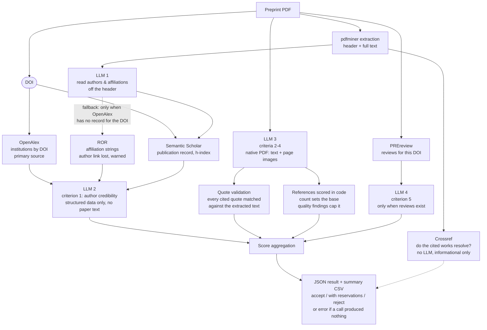

# Preprint Classification System

**LLM-based scoring of preprints that cite genomic data, to decide which ones get linked
to the genome records they cite.**

A preprint that cites genomic sequence data is a candidate for being linked to the entry
of that genome in a surveillance database. Whether it qualifies is a judgment about the
paper itself, made one preprint at a time. This repository automates it: a PDF goes in, a
five-criterion score comes out, with a written justification per criterion and a
recommendation of `accept`, `accept_with_reservations` or `reject`.


---

## Grounding and verification

An unaided LLM judgment on a paper is confident, unverifiable, and wrong in ways that do
not show. Four design choices address that:

| Problem | What the pipeline does |
|---|---|
| The model cannot know if an institution or an author is real | Affiliations resolved against **ROR** and **OpenAlex**, author records against **Semantic Scholar**, by DOI first, name-matching only as a labelled fallback |
| The model invents supporting quotes | Every quote it cites is matched back against the extracted PDF text (`validate_quotes`); an unverifiable quote caps that criterion |
| The model bluffs about the bibliography | The `references` score is computed in code: the count it reports sets the base, the problems it reports can only lower it. Entries are separately resolved against **Crossref** |
| Silent data gaps become silent scoring errors | Enrichment failures surface as `data_quality_warnings`, and the prompt names the fields the model may *not* trust |

One exception is documented rather than hidden: whether a cited work is off-topic,
non-peer-reviewed or a self-citation is the model's own reading, unverified. Those three
inputs lower the `references` score on its word alone, recorded in `score_note` so a
reviewer can see what triggered them. Crossref returns type and author list for every
entry that resolves, so two of the three can be grounded; that is the next step.

---

## Architecture



The institution lookup is anchored on the DOI, not on what the model read off the header,
so a misread affiliation cannot poison the grounding. The model's extraction is used only
when OpenAlex has no record for the DOI, and that path is flagged as a data-quality
warning because it loses the author-to-institution link. Author credibility never sees the
paper text, so a persuasive paper cannot argue its way into a better affiliation score.

---

## The rubric

Nine scored rows grouped into five criteria, each scored 1 (weak) / 2 (moderate) /
3 (strong) on its own evidence. Composite criteria average their rows. Declared in
[`criteria.yaml`](criteria.yaml), so the scoring logic lives in data, not in prompt strings.

| Criterion | Row | A 3 requires | Grounded in |
|---|---|---|---|
| **1. Author credibility** | institution reputability | corresponding author at a recognised institution | ROR + OpenAlex |
| | author expertise | 3+ authors with a publication record in the field | Semantic Scholar |
| | institutional collaboration | more than 3 institutes | OpenAlex |
| **2. Research question & methods** | objective & hypothesis | explicit, testable, tied to prior evidence | paper text |
| | public-health relevance | tied to a known outbreak | paper text |
| | study-design rigour | validated methods, data available to replicate | paper text |
| **3. Results & conclusion** | | consistent, multi-method, limitations discussed | paper text |
| **4. References** | | 20+, balanced, domain-relevant, peer-reviewed | count + quality, scored in code |
| **5. Community feedback** | | expert reviews, citations, author responses | PREreview |

Every paper-text row is quote-validated: the model cites the sentence it scored on, and
that sentence has to exist in the paper.

<details>
<summary><strong>Full 1 / 2 / 3 definitions for every row</strong></summary>

**1a. Institution reputability**: *Authors are affiliated with reputable universities, research institutes or recognised labs*
1. Some authors affiliated with low-credibility institutions such as predatory "universities" or commercial entities.
2. All authors affiliated with a credible university or lab with some research output and relevant expertise.
3. The above, and the main or corresponding author is from a well-established, globally or nationally recognised research institution.

**1b. Author expertise**: *Authors have verifiable expertise and prior publications in the field*
1. Little or none.
2. Up to 2 authors with verifiable expertise.
3. Three or more authors with verifiable expertise.

**1c. Institutional collaboration**: *The study is collaborative, involving multiple institutes*
1. Single institution.
2. Two or three institutes.
3. More than three institutes.

**2a. Objective and hypothesis**: *The study objective and hypotheses are clearly written*
1. Objective is unclear, missing or vague.
2. Objective is clear but lacks precision or a clear connection to methods and results.
3. Objective and hypotheses are explicit, testable and aligned with theory or prior evidence, with a clear sense of why the study matters.

**2b. Public-health relevance**: *The study addresses a pressing public health concern*
1. No.
2. Yes.
3. Yes, and it relates to a known outbreak (e.g. WHO Disease Outbreak News).

**2c. Study-design rigour**: *Study design is clear and rigorous, with sufficient detail for reproducibility*
1. Methodology is missing.
2. Design briefly described but lacking detail, or preliminary results with no validation.
3. Clear and rigorous design with methods validating the results; data, code and materials openly available or described in enough detail to replicate.

**3. Results and conclusion**
1. Results lack supporting figures or tables, or are inconsistent with the data and methods described; conclusions overstated, speculative or not grounded in the evidence.
2. Some inconsistencies in reporting or unclear statistical parameters; conclusions cautious but lacking clarity or only partially supported.
3. Findings internally consistent, validated by multiple methods where applicable, aligned with the hypotheses; results clearly interpreted and limitations explicitly discussed.

**4. References**
1. Fewer than ~10 references, missing foundational studies; overreliance on non-peer-reviewed sources, obscure journals or self-citations.
2. Relevant and credible sources but omitting some important recent work; roughly 10 to 20 references.
3. Balanced mix of foundational, recent and domain-relevant peer-reviewed studies (more than ~20), used to justify methods, contextualise findings and discuss limitations.

**5. Community feedback**
1. No comments or reviews on the preprint server; mentions limited to social media or unverified sources.
2. Feedback on clarifications or methods but not full validation; early signs of citation or scholarly discussion; mixed or tentative reception.
3. Multiple expert-level comments or peer reviews; follow-up analyses or scholarly citations already exist; authors have responded responsibly.

</details>

Two rows behave differently from the rest. **References** is never scored by the model:
the count sets the base, an off-topic entry caps it at 2, and a bibliography more than
half non-peer-reviewed or self-cited drops to 1. The model can judge quality but could not
compare its own count against a threshold, once classifying 58 references as "within
10-20". **Community feedback** is scored only when PREreview holds reviews for the DOI;
otherwise it stays unscored and leaves the average, rather than taking a 1 that would
apply to almost every preprint.

---

## Quickstart

```bash
pip install -r requirements.txt
cp .env.example .env    # then add your API key
export OPENAI_API_KEY="sk-..."
```

```bash
# one preprint
python evaluate_preprint.py --pdf papers/PAPER.pdf --criteria criteria.yaml \
    --out results_pipeline/PAPER.json

# a directory, consolidated into one CSV
python batch_evaluate.py --papers-dir papers --results-dir results_pipeline \
    --summary results_summary_pipeline.csv

# score pending candidates into the curator worklist, before the decision is made
python score_candidates.py

# cross-model calibration (needs ANTHROPIC_API_KEY)
python batch_evaluate_claude.py && python compare_scores.py
```

### Output shape

```json
{
  "source_pdf": "10.1101_2025.06.14.659623.pdf",
  "model": "gpt-5.6-terra",
  "n_pages": 60,
  "author_enrichment": { "...ROR / OpenAlex / Semantic Scholar evidence..." },
  "criteria": {
    "author_credibility": { "score": 3, "justification": "...", "sub_criteria": {} },
    "research_question_and_methods": { "score": 3, "quote_valid": true },
    "results_and_conclusion": { "score": 2, "justification": "..." },
    "references": { "score": 3, "citation_verification": {} },
    "feedback": { "score": null }
  },
  "scoring": {
    "average": 2.75, "total": 11, "max": 12,
    "recommendation": "accept", "quotes_invalid": [], "failed_criteria": []
  },
  "data_quality_warnings": []
}
```

Stored results are not published: they carry per-author bibliometric profiles and
automated critical judgments of identifiable researchers' preprints, which do not belong
in a public repository.

---

## Observed failure modes

Issues found in real runs, now reflected in the design:

- Some providers refuse certain scientific topics outright → the pipeline runs multiple
  backends over one shared rubric.
- A failed call must never be indistinguishable from a valid low score → failures are
  marked `error`, never scored.
- Score patterns can reflect prompt framing rather than paper quality → tuned per
  criterion in the prompt, not patched in aggregation.
- Agreement between models can mask different scoring logic → not treated as validation
  by itself.
- A raw similarity score is not verification → citation matches are corroborated by
  title, author and year.

---

## Repository layout

| Path | Role |
|---|---|
| `evaluate_preprint.py` | Core pipeline: extraction, API grounding, prompts, quote validation, scoring |
| `criteria.yaml` | The rubric: criteria, sub-criteria and score definitions |
| `score_candidates.py` | Scores pending candidates into the curator worklist before the decision is made |
| `batch_evaluate.py` · `weekly_update.py` | Batch runs over a directory of PDFs, and the weekly orchestration |
| `evaluate_preprint_claude.py` · `_deepseek.py` · `compare_scores.py` | Alternative backends and the cross-model agreement report |

Source PDFs and internal curation data are deliberately not versioned; see `.gitignore`.

---

## Roadmap

- [ ] Ground self-citation and peer-review status in Crossref instead of the model's read
- [ ] Score institute count in code, as reference count already is
- [ ] Stamp a rubric version into every stored result
- [ ] Prompt work on `results_and_conclusion`, the least stable criterion
- [ ] Complete the DeepSeek backend and re-run the refusal comparison across all three

---

## License

MIT. See [LICENSE](LICENSE).

Built for genomic-surveillance curation work. Preprint content belongs to its respective
authors; this repository contains only automatically generated assessments of publicly
available preprints.
